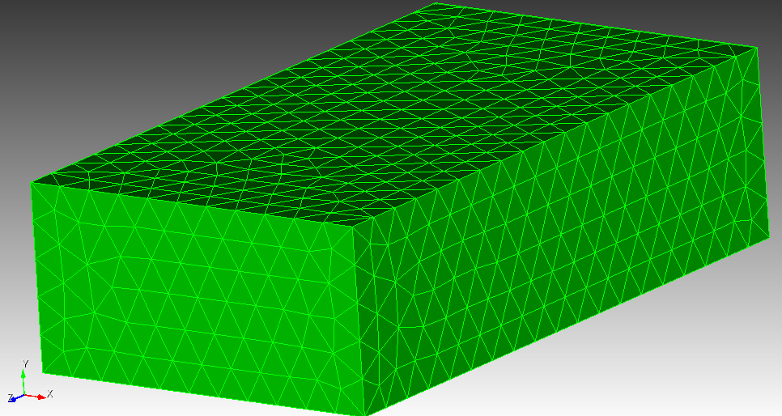
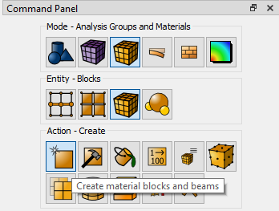
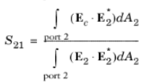
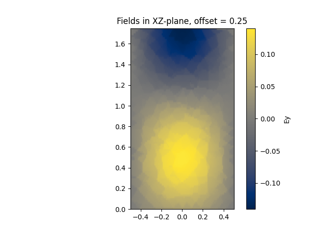
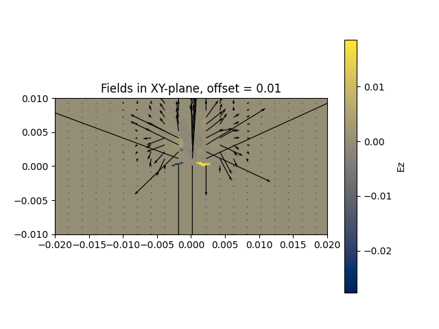

# 3D FEM Solver

## Overview
This software provides a semi-general-purpose FEM simulator for 3D geometries. It takes a .inp file (usually generated in Coreform Cubit) and performs a simulation on it. The code is currently set up to have 1 input port and 1 output port.

A lot of the software written is commented. A good majority of the functions/methods have docstring comments, meaning they can generate nice-looking PDFs or webpages of documentation if you feed it into a program like Sphinx. There will be some minor errors/typos and mistakes here or there, so take them with a grain of salt.

## FEM Process Steps
There are several steps that must be done in order to perform a simulation.
1. The mesh data from a .inp file must be loaded and manipulated such that the salient data is available to the rest of the program.
2. A matrix equation must be constructed.
3. The matrix equation must be solved.
4. Meaningful results must be generated.

Each of these sections will be addressed next.

### Mesh Loading and Data Structuring Using Coreform Cubit
To understand this section best, you should probably have a .inp file (see the [example](meshes/rectangular_waveguide_12000tets_example.inp) .inp file) to look at for reference, as well as Cubit pulled up. It is assumed we are working with tetrahedrons.

Consider a rectangular waveguide mesh in cubit, as shown below:



When you create a 3D mesh of tetrahedrons in Cubit and export it as a .inp file, Cubit will create a section in the file containing the locations of each node, assigning each a unique number to identify them (essentially a global node number). This section is labeled "ALLNODES" in the .inp file (not sure if you can change this or not). This section will look something like this in the .inp file:

```
********************************** N O D E S **********************************
*NODE, NSET=ALLNODES
       1,    5.000000e-01,   -2.500000e-01,    1.750000e+00
       2,    5.000000e-01,    2.500000e-01,    1.750000e+00
       3,   -5.000000e-01,    2.500000e-01,    1.750000e+00
       4,   -5.000000e-01,   -2.500000e-01,    1.750000e+00
       5,    5.000000e-01,    2.500000e-01,    0.000000e+00
```

One can have Cubit provide more information about the mesh than this by creating what Cubit calls "Blocks". You can see this in the GUI. These Blocks contain information about which node numbers (call them global node numbers if you prefer) make up a particular surface, volume, curve/edge, etc. This information is given in the .inp always in terms of global node numbers.



Suppose we are working with the rectangular waveguide mesh above. We would create a Block for the volume in Cubit. When we export the .inp file, we will see the following information:

```
********************************** E L E M E N T S ****************************
*ELEMENT, TYPE=C3D4, ELSET=Tetrahedrons
       1,     824,     825,     826,     827
       2,     827,     829,     828,     830
       3,     827,     829,     830,     831
       4,     825,     827,     830,     831
       5,     832,     833,     834,     835
```

These are just the first 5 entries of the Block. Each entry describes the 4 nodes of a tetrahedron that makes up part of the voluem. Notice they contain the global node number from the ALLNODES set earlier. It is also worth nothing that Blocks can be named. This one is named "Tetrahedrons", as visible above. This was a choice, not the default. The default names for blocks are usually things like "EB1", "EB2", and so on. It is just a convenience to name them something meaningful.

Similarly, if we created a Block containing information about a surface, each entry would contain 3 global node numbers that make up a triangle on the surface.

#### Current Mesh Loading and Data Structuring Implementation
All of the mesh loading and data structuring is done in util.py. A function called `load_mesh_block()` will take a string containing the name of the Block and return a 2D array containing the data. A function called `load_mesh()` is created with the intention of loading everything needed, and it makes use of the load_mesh_block() function. It accepts a bunch of names for the various necessary blocks in running a simulation (i.e. names for input/output surfaces, pec walls, curves bounding the input/output surfaces, etc.). An example of its usage can be seen in waveport/waveport.py in the Waveguide3D constructor (see `Waveguide3D#__init__()`). See the [examples](#examples) section for how it is used.

### Matrix of Equations Construction
After all of the necessary data is loaded and structured, the matrix equation can be constructed. The details of doing this are the bulk of the work in creating a functional FEM solver, and Jin's book mentioned in the [Useful Resources](#useful-resources) section is the most helpful reference for coming up with these.

#### Current Matrix of Equations Construction
This is done with the `Waveguide3D#solve()` method in waveport/waveport.py. It is a bit messy, and should probably be done differently for both organizational and efficiency reasons. Currently, each tetrahedron is iterated over. For each tetrahedron, the interactions of each of the edges that need to be integrated is done by adding 2 more for loops, one nested in the other and each over all of the edges of the tetrahedron. The integrations are performed, with the indices into the matrix equation being determined by the global edge numbers of the edges being iterated over. PEC edges are ignored, being skipped when they are come across in the edge for loops. Special care is taken with edges on surfaces such as the input/output port or ABC walls if there are any.

### Solving the Equation Matrix
The equation matrix can be solved naively by taking an inverse, but iterative methods can be employed if desired. The result of solving this matrix is obviously the desired edge coefficients in the interpolating functions.

#### Current Solving of the Equation Matrix
Currently, the equation matrix is solved by taking an inverse, which is rather expensive.

### Generating Meaningful Results

#### Calculating Fields
The most direct results that can be obtained are the field results associated with the interpolating functions. In order to calculate the field at a given point, we must know the edges that contribute to the field there. This can be done by finding which tetrahedron the point lies in, calculating the field contributed by each edge of that tetrahedron, and summing them together. With the ability to compute the field at any desired point, field plots can be generated.
#### Calculating S-Parameters
The S-parameters of a problem with ports is often desirable. The equations/theory for generating this kind of result can be found on [Comsol's page](https://doc.comsol.com/5.5/doc/com.comsol.help.woptics/woptics_ug_modeling.5.24.html). The equation



allows for the straightforward computation of the S<sub>21</sub> parameter. It is my understanding that the numerator qunatities E<sub>c</sub> and E<sub>2</sub> are the field measured by the tetrahedron interpolating functions and the field profile at the output port of the mode of interest respectively (as though it were an incident field). The denominator quantity E<sub>2</sub> is the incident field of the input port. 

#### Current Results Generation
The current implementation allows for computation and plotting of fields and calculation of basic S-parameters.
##### Current Field Calculations
Currently, the point-identification-based method described above is used to generate field plots. This is actually vectorized using a method found on stack overflow for identifying if a point lies in a given tetrahedron. If you pursue the route of identifying the tetrahedron each point lies in, you will need something vectorized like this, as the cost of taking a single point, looking through each tetrahedron, and repeating for each point is far too expensive (it is bad enough as it is, but not too bad). The current vectorized appraoch is incredibly memory hungry. You probably will not be able to run it on a computer with 8 GB of RAM with a mesh with more than 12k tetrahedrons. I ran everything on Bell after a certain point, so I did not have a memory problem here (though I only tested ~40k tetrahedrons or so). I have gathered that generating plots from 3D simulations is obnoxious, requring a lot of paying attention to details and being difficult to create general-purpose code for. You can see the `Waveguide3D#plot_fields()` method for the implementation.
##### Current S-parameter Calculations
There is currently an S-parameter implementation like that described above, though there is some question as to whether or not this is the proper way to do it (it seemed to work fine and make sense, but should be scrutinized). The `Waveguide3D#compute_s21()` method in waveport/waveport.py performs this calculation.

# Examples
Below are a couple of examples for how this software works.

### Simple Example
We look at a simple example for using the software written below. The geometry is the same as the one used in the [mesh loading](#mesh-loading-and-data-structuring-using-coreform-cubit) section.
```python
# Import matplotlib
import matplotlib.pyplot as plt
# Import Waveguide3D
from waveport.waveport import Waveguide3D

# Construct the Waveguide3D object. This loads the mesh into the object and initializes variables
# This particular geometry is oriented along the z-axis (this was chosen when it was created in Cubit)
waveguide = Waveguide3D.construct_simple("meshes/rectangular_waveguide_12000tets_example.inp", 4)

# Solve the FEM problem. This constructs the matrix equation and solves it by taking a matrix inverse
waveguide.solve()

# Determine how long the geometry is along the z-axis. z_max and z_min are attributes of the Waveguide3D object
y_length = waveguide.y_max - waveguide.y_min

# Produce some field results in the XY plane offset halfway along the geometry. This produces a matplotlib figure.
# On Bell, the interactive mode of matplotlib does not seem to work (it won't pop up an figure to interact with)
waveguide.plot_fields(plane="xz", offset=y_length/2, phase=0)

# matplotlib still works without interactive mode, but you will need to save the the results to view them
plt.savefig("fields_plot_simple.png")
```
The resulting image looks like:



### Advanced Example
More complicated geometries require specifying more details. By no means is this implementation ideal, but it provides an idea about what kind of details you need to pay attention to. A microstrip line example is shown below:

```python
# Import matplotlib
import matplotlib.pyplot as plt
# Import numpy
import numpy as np
# Import Waveguide3D
from waveport.waveport import Waveguide3D

# Construct the Waveguide3D object. This loads the mesh into the object and initializes variables
# This particular geometry is oriented along the z-axis (this was chosen when it was created in Cubit)
# The volume names, volume permittivities, and PEC name
vn, vp, pn = ["TetrahedronsVacuum", "TetrahedronsSubstrate"], [1, 4.5], "PECWalls"
# The Absorbing Boundary Condition walls name (if it exists)
abcn = "ABC"
# The input port surface names, the input port boundary name, and the input port permittivities
# There are two input port surfaces for the microstrip line. The substrate part and the vacuum/air part.
ipn, ipbn, ipp = ["InputPortVacuum", "InputPortSubstrate"], "InPortPEC", [1, 4.5]
# The output port surface names, the output port boundary name, and the output port permittivities
# There are two output port surfaces for the microstrip line. The substrate part and the vacuum/air part.
opn, opbn, opp = ["OutputPortVacuum", "OutputPortSubstrate"], "OutPortPEC", [1, 4.5]
# Integration lines. These are optional, but if included can guarantee the polarity of the fields in a simulation.
# Not doing this will give correct field results, but the input and output port field profiles used in the
# S-parameter calculations may be opposite of each other, causing the phase of S21 to be incorrect.
# This idea is identical to the integration lines you have to choose in HFSS.
p1ip, p2ip = np.array([0, 0.0008]), np.array([0, 0])
p1op, p2op = np.array([0, 0.0008]), np.array([0, 0])
# The chosen operating frequency. k0 = 2*pi*f/c to convert to/from frequency.
k0 = 4
# Create the Waveguide object with those specifications
waveguide = Waveguide3D("meshes/microstrip_line_44000tets_pec_walls_example.inp", k0, vn, vp, pn, abcn, ipn, ipbn, ipp, opn, opbn, opp, p1ip, p2ip, p1op, p2op)

# Everything else is now the same as the simple example.
# Solve the FEM problem. This constructs the matrix equation and solves it by taking a matrix inverse
waveguide.solve()

# Determine how long the geometry is along the z-axis. z_max and z_min are attributes of the Waveguide3D object
z_length = waveguide.z_max - waveguide.z_min

# Produce some field results in the XY plane offset halfway along the geometry. This produces a matplotlib figure.
# On Bell, the interactive mode of matplotlib does not seem to work (it won't pop up an figure to interact with)
waveguide.plot_fields(plane="xy", offset=z_length/2, phase=0)

# matplotlib still works without interactive mode, but you will need to save the the results to view them
plt.savefig("fields_plot_advanced.png")
```
The resulting image looks like:



## Useful Resources
There are a few resources that were very helpful in the construction of this software. I have listed them here.

1. Jin's Book (Theory and Computation of Electromagnetic Fields) - General FEM principles and basic problem formulations
2. [NASA FEM Paper](readme_refs/nasa_fem_paper.pdf) - An easy-to-understand read and has equations for the interpolating functions and some integrals. Good supplement to Jin's book.
3. [Comsol Equations](https://doc.comsol.com/5.5/doc/com.comsol.help.woptics/woptics_ug_modeling.5.24.html) - Helpful for understanding S-parameter calculations (the S-parameter section above is a good supplement)
4. Jin's other Book - Used this when making sense of S-parameter calculations
